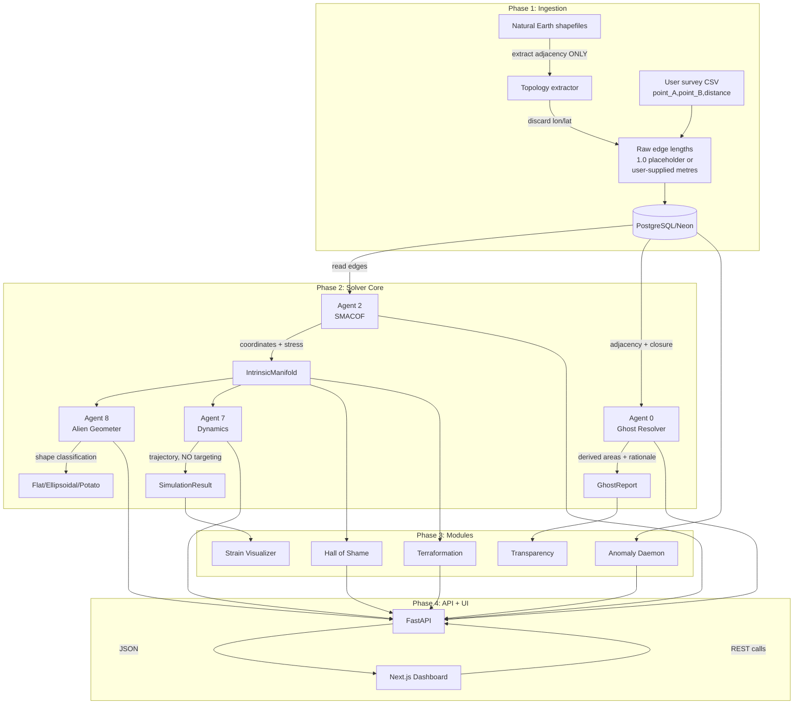

# AETHERA Data Flow

## Key principle

NO pre-computed areas flow through this pipeline. The only inputs are:
1. **Adjacency topology** (which points connect to which).
2. **Raw edge lengths** (1.0 placeholders or user-supplied metres).
3. **Global area invariants** (user-supplied scalar totals).

All areas, coordinates, and shapes are derived by the solvers.
